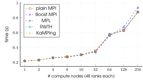

[](https://github.com/kamping-site/kamping/actions/workflows/build.yml)

[](https://doi.org/10.5281/zenodo.10949643)

# KaMPIng: Karlsruhe MPI next generation :rocket:


This is KaMPIng [kampɪŋ], a (near) zero-overhead MPI wrapper for modern C++.

It covers the whole range of abstraction levels from low-level MPI calls to
convenient STL-style bindings, where most parameters are inferred from a small
subset of the full parameter set. This allows for both rapid prototyping and
fine-tuning of distributed code with predictable runtime behavior and memory
management.

Using template-metaprogramming, only code paths required for computing
parameters not provided by the user are generated at compile time, which results in (near) zero-overhead
bindings.

**:running: Quick Start:**
KaMPIng is header-only, compatible with all major MPI implementations and requires a C++17-ready compiler.
The easiest way to get started is to include KaMPIng using CMake's FetchContent module.
```cmake
include(FetchContent)
FetchContent_Declare(
  kamping
  GIT_REPOSITORY https://github.com/kamping-site/kamping.git
  GIT_TAG v0.1.1
)

FetchContent_MakeAvailable(kamping)
target_link_libraries(myapp PRIVATE kamping::kamping)
```
It is fully compatible with your existing MPI code and you can start using it right away. Just include the headers for the main communicator class and the MPI call that you want to use.

``` c++

#include <kamping/communicator.hpp>
#include <kamping/collectives/allgather.hpp>

kamping::Communicator comm;
 
std::vector<int> input(comm.rank(), comm.rank_signed());
auto const result = comm.allgatherv(kamping::send_buf(input));
```

We provide a wide range of [usage](./examples/usage) and [simple applications](./examples/applications) examples (start with [`allgatherv`](./examples/usage/allgatherv_example.cpp)). Or checkout the [documentation](https://kamping-site.github.io/kamping/) for a description of KaMPIng's core concepts and a full reference.

KaMPIng is developed at the [Algorithm Engineering
Group](https://ae.iti.kit.edu/english/index.php) at Karlsruhe Institute of
Technology.

If you use KaMPIng in the context of an academic publication, we kindly ask you to cite our [SC'24 paper](https://doi.org/10.1109/SC41406.2024.00050):

``` bibtex
@inproceedings{kamping2024,
  author       = {Uhl, Tim Niklas and Schimek, Matthias and Hübner,
                  Lukas and Hespe, Demian and Kurpicz, Florian and
                  Seemaier, Daniel and Stelz, Christoph and Sanders,
                  Peter},
  booktitle    = {SC24: International Conference for High Performance
                  Computing, Networking, Storage and Analysis},
  title	       = {KaMPIng: Flexible and (Near) Zero-Overhead C++
                  Bindings for MPI},
  year	       = {2024},
  pages	       = {1-21},
  doi	       = {10.1109/SC41406.2024.00050}
}
```

You can also find a [freely accessibly post-print in the arXiv.](https://arxiv.org/abs/2404.05610)

## Features :sparkles:
### Named Parameters :speech_balloon:
Using plain MPI, operations like `MPI_Allgatherv` often lead to verbose and error-prone boilerplate code:

``` c++
std::vector<T> v = ...; // Fill with data
int size;
MPI_Comm_size(comm, &size);
int n = static_cast<int>(v.size());
std::vector<int> rc(size), rd(size);
MPI_Allgather(&n, 1, MPI_INT, rc.data(), 1, MPI_INT, comm);
std::exclusive_scan(rc.begin(), rc.end(), rd.begin(), 0);
int n_glob = rc.back() + rd.back();
std::vector<T> v_glob(v_global_size);
MPI_Allgatherv(v.data(), v_size, MPI_TYPE, v_glob.data(), rc.data(), rd.data(), MPI_TYPE, comm);

```

In contrast, KaMPIng introduces a streamlined syntax inspired by Python's named parameters. For example, the `allgatherv` operation becomes more intuitive and concise:

```c++
std::vector<T> v = ...; // Fill with data
std::vector<T> v_glob = comm.allgatherv(kamping::send_buf(v));
```

Empowered by named parameters, KaMPIng allows users to name and pass parameters in arbitrary order, computing default values only for the missing ones. This not only improves readability but also streamlines the code, providing a user-friendly and efficient way of writing MPI applications.

### Controlling memory allocation :floppy_disk:
KaMPIng's *resize policies* allow for fine-grained control over when allocation happens:

| resize policy            |                                                                         |
|--------------------------|-------------------------------------------------------------------------|
| `kamping::resize_to_fit` | resize the container to exactly accommodate the data                    |
| `kamping::no_resize`     | assume that the container has enough memory available to store the data |
| `kamping::grow_only`     | only resize the container if it not large enough                        |


``` c++
// easy to use with sane defaults
std::vector<int> v = comm.recv<int>(kamping::source(kamping::rank::any));

// flexible memory control
std::vector<int> v_out;
v_out.resize(enough_memory_to_fit);
// already_known_counts are the recv_counts that may have been computed already earlier and thus do not need to be computed again
comm.recv<int>(kamping::recv_buf<kamping::no_resize>(v_out), kamping::recv_count(i_know_already_know_that), kamping::source(kamping::rank::any));
```

### STL support :books:
- KaMPIng works with everything that is a `std::contiguous_range`, everywhere.
- Builtin C++ types are automatically mapped to their corresponding MPI types. 
- All internally used containers can be altered via template parameters.
### Expandability :jigsaw:
- Don't like the performance of your MPI implementation's reduce algorithm? Just override it using our plugin architecture.
- Add additional functionality to communicator objects, without altering any application code.
- Easy to integrate with existing MPI code.
- Flexible core library for a new toolbox :toolbox: of distributed datastructures and algorithms

### And much more ... :arrow_upper_right:
- Safety guarantees for non-blocking communication and easy handling of multiple requests via request pools
- Compile time and runtime error checking (which can be completely deactivated).
- Collective hierarchical timers to speed up your evaluation workflow.
- ...

Dive into the [documentation](https://kamping-site.github.io/kamping/) or [tests](https://github.com/kamping-site/kamping/tree/main/tests) to find out more ...

### (Near) zero overhead - for development and performance :chart_with_upwards_trend:
Using template-metaprogramming, KaMPIng only generates the code paths required for computing parameters not provided by the user. 
The following shows a complete implementation of distributed sample sort with KaMPIng. 

```c++
void sort(MPI_Comm comm_, std::vector<T>& data, size_t seed) {
    Communicator<> comm(comm_);
    size_t const   oversampling_ratio = 16 * static_cast<size_t>(std::log2(comm.size())) + 1;
    std::vector<T> local_samples(oversampling_ratio);
    std::sample(data.begin(), data.end(), local_samples.begin(), oversampling_ratio, std::mt19937{seed});
    auto global_samples = comm.allgather(kamping::send_buf(local_samples));
    std::sort(global_samples.begin(), global_samples.end());
    for (size_t i = 0; i < comm.size() - 1; i++) {
        global_samples[i] = global_samples[oversampling_ratio * (i + 1)];
    }
    global_samples.resize(num_splitters);
    std::vector<std::vector<T>> buckets(global_samples.size() + 1);
    for (auto& element: data) {
        auto const bound = std::upper_bound(global_samples.begin(), global_samples.end(), element);
        buckets[static_cast<size_t>(bound - global_samples.begin())].push_back(element);
    }
    data.clear();
    std::vector<int> scounts;
    for (auto& bucket: buckets) {
        data.insert(data.end(), bucket.begin(), bucket.end());
        scounts.push_back(static_cast<int>(bucket.size()));
    }
    data = comm.alltoallv(kamping::send_buf(data), kamping::send_counts(scounts));
    std::sort(data.begin(), data.end());
}
```
It is a lot more concise than the [(verbose) plain MPI implementation](./examples/applications/sample-sort/mpi.hpp), but also introduces no additional overhead to achieve this, as can be seen the following experiment. There we compare the sorting implementation in KaMPIng to other MPI bindings.


## Platform :desktop_computer:
- intensively tested with GCC and Clang and OpenMPI
- requires a C++17 ready compiler
- easy integration into other projects using modern CMake
   
## Other MPI bindings
|                                                      | [MPI](https://www.mpi-forum.org/) | [Boost.MPI](https://www.boost.org/doc/libs/1_84_0/doc/html/mpi.html) | [RWTH MPI](https://github.com/VRGroupRWTH/mpi) | [MPL](https://github.com/rabauke/mpl) |  |
|------------------------------------------------------|:---------------------------------:|:--------------------------------------------------------------------:|:----------------------------------------------:|:-------------------------------------:|:-----------------------------------------------:|
| STL support                                          | :x:                               | :heavy_check_mark:[^2]                                               | :heavy_check_mark:[^3]                         | :heavy_check_mark:[^2]                | :white_check_mark:                              |
| computation of defaults via additional communication | :x:                               | :x:                                                                  | :white_check_mark:                             | :x:                                   | :white_check_mark:                              |
| custom reduce operations via lambdas                 | :x:                               | :white_check_mark:                                                   | :x:                                            | :heavy_check_mark:[^4]                | :white_check_mark:                              |
| containers can be resized automatically              | :x:                               | :heavy_check_mark:[^1]                                               | :heavy_check_mark:[^3]                         | :x:                                   | :white_check_mark:                              |
| error handling                                       | :white_check_mark:                | :white_check_mark:                                                   | :white_check_mark:                             | :x:                                   | :white_check_mark:                              |
| actively maintained                                  | :white_check_mark:                | :x:                                                                  | :heavy_check_mark:                             | :white_check_mark:                    | :white_check_mark:                              |

[^1]: partial 

[^2]: only `std::vector` 

[^3]: only for send and receive buffers

[^4]: not mapped to builtin operations

## LICENSE
KaMPIng is released under the GNU Lesser General Public License. See [COPYING](COPYING) and [COPYING.LESSER](COPYING.LESSER) for details
